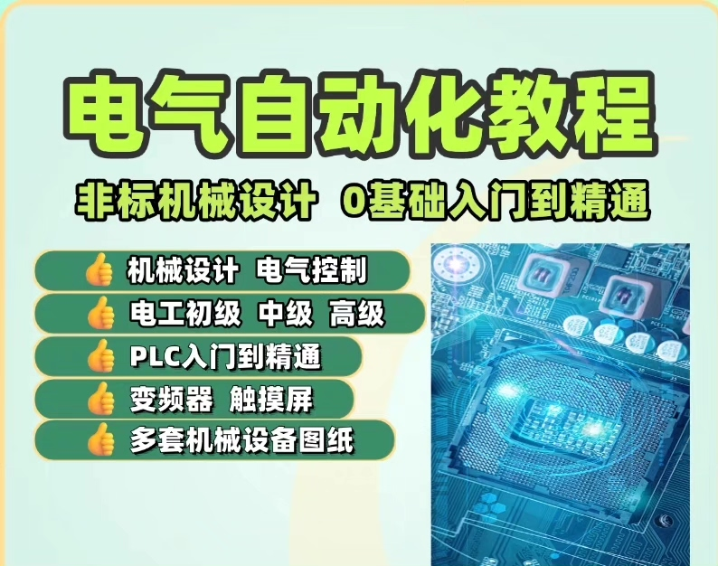
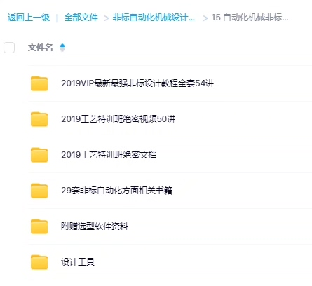
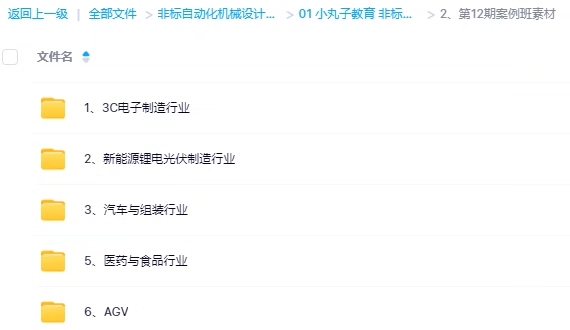

# Non-standard mechanical automation equipment tutorials, teaching, selection, and non-standard courses

## Body

Non-standard Machinery Automation Equipment Tutorials, Teaching, Selection, Non-standard Courses
Strongest Non-standard Automation Equipment Mechanical Design Tutorial
Standard Parts, Common Parts, General Parts, FA Factory Automation Parts Accessories
Conveyor Uploading Motor Power, Pneumatic Cylinder, Teaching Courses, Training with Driven Power
Automatically Calculated Tables, Mechanical Software, Selection Plugins, Mechanical Design Manuals, Engineers' Handbooks

## Images

## Payment

Here is a pay link on Stripe ( https://buy.stripe.com/3cs8yP7sY87d0vu9AB ). Please contact me lonlonago@foxmail.com after funding $89, and I will send you a complete data files , thank you!

